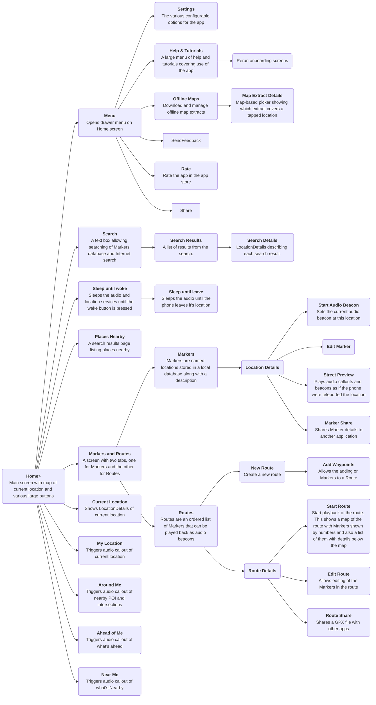

# Soundscape Android architecture

This document describes the basic architecture of the app and the various UI screens. The main purpose of the app is to provide audio cues to aid navigation and improve awareness of surroundings for the visually impaired. The screen UI is important for setting up the location of audio markers and creating routes, but the audio UI is at least as important. Because the audio has to continue running when the phone is locked, the audio UI is all driven from a foreground service which carries on running when other apps are in use and when the phone is locked.

## Soundscape foreground service
The foreground service (`SoundscapeService`) needs to know the current location and the direction that the phone is pointing. It uses those in conjunction with Mapbox Vector Tile data — fetched from our protomaps tile server when online, or read from a downloaded `.pmtiles` extract when offline — to generate strings that describe the current location (known as callouts). Tile parsing and the searchable `FeatureTree`s are described in the [GeoEngine document](). Audio beacons and speech are played out via the `AudioEngine` described [here]().

The location and direction are provided by the `LocationProvider` and `DirectionProvider` classes. During normal operation these use the Android `FusedLocationProvider`, and `FusedOrientationProvider` APIs. However, in Street preview mode the `LocationProvider` can use a fixed location, effectively teleporting the user so that they can hear the callouts for somewhere they are planning on traveling to.

A `KalmanFilter` class is used to filter the locations from `FusedLocationProvider` to reduce jumps in location. Kalman filters perform a weighted average on the current location and the location from the OS to give a new location. The weighting is based on the accuracy value provided by the OS so that low accuracy locations move the position more slowly than high accuracy ones.

## Offline maps
The app can also be driven entirely from downloaded map extracts so that users can run with no network. Extracts are `.pmtiles` files covering a country, state or other region, generated from the planet-wide map and served from Cloudflare R2. See [Offline maps]() for the extract pipeline and [Cloudflare setup]() for the hosting side. Within the app, extracts are downloaded and managed from the Offline Maps screen (reached from the menu, or during onboarding); the same screen offers a map-based picker that lets the user choose extracts by tapping the region they cover.

## Audio control while the screen is locked
Because Soundscape is primarily an audio app it is essential that the user can drive it without unlocking the phone. Three control surfaces are supported in addition to the touch UI:

1. Media-key shortcuts (play/pause/next/previous on a headset or watch), modelled on the iOS app's bindings.
2. Voice commands — the user tap-and-holds a media key to enter a listening state, speaks a command, and the recognised text is dispatched to the same handlers as the touch UI.
3. An audio menu — repeated media-key presses walk a tree of spoken menu options that mirrors the GUI.

See [Voice and audio menu control]() for the command catalogue and menu layout. The implementation lives in `services/mediacontrol/` (`MediaControlTarget`, `VoiceCommandManager`, `AudioMenu`, `SoundscapeMediaSessionCallback`).

## Onboarding Activity
The onboarding screens have been given their own activity. Onboarding screens guide the users through some initial choices of language,  permissions and audio beacon settings. Onboarding screens are only shown the first time through the app, or if the user selects *App Setup* from within the *Help & Tutorials* section of the menu.

## Main Activity
This is where the app normally spends its time. The `Home` screen looks like this:

The map is zoomed around the current location and rotated based on the direction that the phone is pointing in. Here's what can be accessed from the Home screen:

