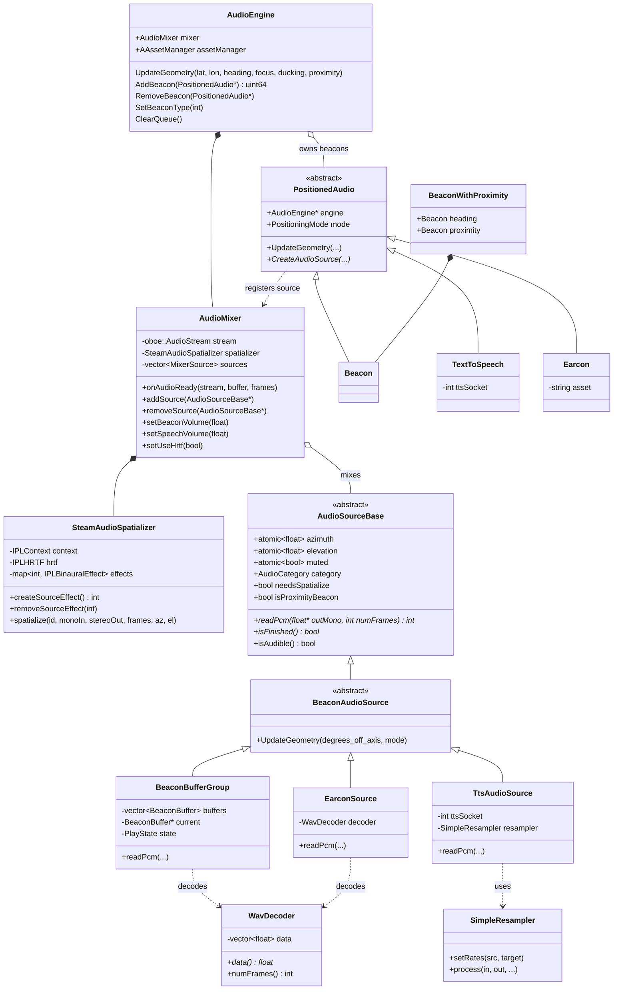

# Audio engine for Soundscape

The audio engine is responsible for playing audio beacons, text-to-speech callouts and earcons. The bulk of it is written in C++ so that it can drive [Oboe](https://github.com/google/oboe) (low-latency audio I/O) and [Steam Audio](https://valvesoftware.github.io/steam-audio/) (HRTF binaural rendering) directly. A thin Kotlin layer exposes the engine to the rest of the app via JNI.

## Code layout

| Location | Contents |
| --- | --- |
| `app/src/main/cpp/` | C++ engine sources, Steam Audio headers, `CMakeLists.txt` |
| `app/src/main/cpp/steamaudio/include/` | Steam Audio (Phonon) headers |
| `app/src/main/jniLibs/<abi>/libphonon.so` | Pre-built Steam Audio shared library, one per ABI |
| `app/src/main/java/.../audio/` | Kotlin interface, JNI bridge, TTS glue |

Supported ABIs: `arm64-v8a`, `armeabi-v7a`, `x86`, `x86_64`. The CMake build pulls Oboe via Prefab (`find_package(oboe REQUIRED CONFIG)`) and imports `libphonon.so` as a shared library.

## C++ architecture



### AudioEngine

`AudioEngine` is the top-level object. It owns an `AAssetManager*` (handed in from Kotlin), an `AudioMixer`, and the set of currently-playing `PositionedAudio` objects. It is responsible for:

* Updating listener geometry on every Kotlin-side location/heading tick (`UpdateGeometry`).
* Holding a queue of pending TTS beacons and starting them in order (`AddBeacon`/`ClearQueue`).
* Notifying Kotlin when all beacons have finished via a JNI callback (`SetBeaconEventsListener` → `onAllBeaconsCleared`), so the service can release audio focus.
* Maintaining the chosen beacon type (`SetBeaconType`) — descriptors are looked up from the static `msc_BeaconDescriptors[]` table.

### AudioMixer

`AudioMixer` opens a single stereo float32 Oboe output stream at the device-native sample rate (typically 48 kHz) and mixes all active sources in its `onAudioReady` callback. Key behaviour:

* Stream is opened with `PerformanceMode::None`, `SharingMode::Shared`, fixed `FRAME_SIZE = 1024` frames per callback.
* Sources are stored as `MixerSource { AudioSourceBase*, int effectId }` and accessed under `m_SourcesMutex`.
* Two volume atomics (`m_BeaconVolume`, `m_SpeechVolume`) plus automatic ducking: when any speech source is audible, beacons are attenuated to 25% and speech to 75% to avoid clipping.
* Per-callback pipeline for each audible source:
  1. Pull mono frames at device rate via `source->readPcm(...)`.
  2. If `needsSpatialize` and HRTF is on, route through `SteamAudioSpatializer::spatialize()` to produce interleaved stereo.
  3. If HRTF is off, pan in stereo using `sin(azimuth)` so the response is smooth around 360°.
  4. Sounds behind the listener (`cos(azimuth) < 0`) are attenuated by up to 50%.
  5. Mix into the output buffer and finally clamp to `[-1, 1]`.
* Handles Oboe device disconnects (`onErrorAfterClose` → `ErrorDisconnected`) by reopening the stream, re-registering all sources with a fresh spatializer, and emitting ~400 ms of silence (`m_WarmupFrames`) to let the new audio sink — typically Bluetooth A2DP — stabilise. Restart can be suppressed via `setSuppressRestart` to avoid races during SCO transitions; a pending restart is executed when suppression is lifted.

### SteamAudioSpatializer

Wraps the Steam Audio context, HRTF, and a `map<int, IPLBinauralEffect>` of per-source effects. Each `AudioSourceBase` that needs spatialisation gets a binaural effect ID at `addSource` time and releases it at `removeSource`. Steam Audio's coordinate system is `+x = right`, `+y = up`, `-z = forward`; `spatialize()` converts `(azimuth, elevation)` to a unit direction vector and applies the binaural effect to a mono input buffer, producing interleaved stereo.

### AudioSourceBase and its subclasses

`AudioSourceBase` is the pull interface every source implements:

```cpp
virtual int readPcm(float *outMono, int numFrames) = 0;
virtual bool isFinished() const = 0;
```

It also carries the spatial atomics (`azimuth`, `elevation`, `muted`), an `AudioCategory` (`BEACON` or `SPEECH`) for volume routing, the `needsSpatialize` flag (false for 2D/STANDARD audio), and `isProximityBeacon` for the close-range beacon variant.

Concrete sources:

* **`BeaconBufferGroup`** — beacon WAV playback driven by listener heading. Holds an optional intro `BeaconBuffer`, a vector of directional `BeaconBuffer`s (one per heading sector), and an optional outro. Each frame group it selects which buffer is "active" based on `degrees_off_axis` and the buffer's `m_MaxAngle`, falling back to silence between sectors. The play state machine moves intro → beacon → outro → complete.
* **`TtsAudioSource`** — reads raw PCM bytes from a Unix socket fed by `TtsEngine` on the Kotlin side. The TTS engine reports its own sample rate / format / channel count via the `audioConfigTextToSpeech` JNI call; that drives a `SimpleResampler` so the source can emit device-rate float32 frames in real time.
* **`EarconSource`** — one-shot WAV playback for short cues (earcons such as `online.wav`, `sense_poi.wav`, etc. — see the `EARCON_*` constants in `NativeAudioEngine.kt`). Pre-decoded to mono float32 at device rate by `WavDecoder`.

### PositionedAudio

`PositionedAudio` and its three subclasses (`Beacon`, `TextToSpeech`, `Earcon`) sit between Kotlin and the audio sources. Each holds a `PositioningMode` (`STANDARD` / `LOCALIZED` / `RELATIVE` / `COMPASS`, plus heading vs. proximity mode), creates an appropriate `BeaconAudioSource` subclass, and registers it with the mixer.

`UpdateAzimuth()` is the bridge between map space and audio space: it computes the bearing from the listener to the source and subtracts the listener heading, then stores the result (in radians) into `AudioSourceBase::azimuth`. Because that field is atomic, the audio callback can sample it from the audio thread without locking against the game thread.

`BeaconWithProximity` is a small wrapper used by `createNativeBeacon` that pairs a heading beacon with an optional proximity beacon. The proximity beacon is non-directional (`STANDARD`) and is mixed independently of the main beacon.

### WavDecoder and SimpleResampler

`WavDecoder(AAssetManager*, path, targetRate)` parses a WAV asset (stripping the `file:///android_asset/` prefix if present), converts to mono float32, and resamples to `targetRate` if requested. Beacon and earcon assets are pre-resampled to the device sample rate at load time so the audio callback never has to resample them.

`SimpleResampler` is a linear-interpolation resampler that maintains its state across calls (`m_SrcPos`, `m_PrevSample`). It is used by `TtsAudioSource` to bridge between the TTS engine's sample rate (which can vary by voice/engine) and the device output rate.

## Threading model

There are two threads of interest:

* **Game thread** — driven from Kotlin via JNI. Calls `UpdateGeometry`, creates/destroys beacons, mutates `azimuth`/`muted`/volume atomics.
* **Audio callback thread** — Oboe-owned, runs `AudioMixer::onAudioReady`. Reads atomics, acquires `m_SourcesMutex` (a regular `std::mutex` — `lock_guard`, not `try_lock`, despite the audio-callback rule of thumb — so source mutation must be quick).

Spatial state crosses the boundary as atomics; the source list crosses as a mutex-guarded vector. Source lifetime is managed by `PositionedAudio` on the game thread: it registers with the mixer in its constructor and removes itself in its destructor.

## Asset conventions

* Beacon WAVs live under `app/src/main/assets/Audio/<Beacon>/` and are referenced via `file:///android_asset/...` paths in `BeaconDescriptor`.
* Each beacon descriptor specifies the number of beats in a phrase and the per-direction WAV files (with a `max_angle` for the sector).
* Earcons live under `assets/earcons/`. See the `EARCON_*` constants in `NativeAudioEngine.kt` for the full list.
* The proximity beacon (`Audio/Route/Proximity_Close.wav` and `Proximity_Far.wav`) is hard-coded in `msc_ProximityDescriptor` in `AudioBeacon.h`.

## JNI bridge

The Kotlin → C++ bridge follows the standard "opaque handle" pattern: Kotlin holds a `Long` that is the `reinterpret_cast` of a C++ pointer, and JNI entry points cast it back. The native library is loaded once in `NativeAudioEngine`'s companion object:

```kotlin
init { System.loadLibrary("soundscape-audio") }
```

The lifecycle entry points are:

```kotlin
private external fun create(assetManager: AssetManager) : Long
private external fun destroy(engineHandle: Long)
```

`create()` takes an `AssetManager` so the C++ side can resolve `file:///android_asset/...` paths via `AAssetManager_fromJava`. All subsequent JNI calls take the `engineHandle` as their first argument. Beacons, TTS items and earcons each return their own handle that the Kotlin side stores and later passes to `destroyNativeBeacon` (or equivalent) — these are stored in the `AudioEngine`'s beacon set on the C++ side.

C++ → Kotlin callbacks go via a single registered listener (`SetBeaconEventsListener`/`ClearBeaconEventsListener`), with a cached `JavaVM*` and global reference. The current callback is `onAllBeaconsCleared`, used by `SoundscapeService` to release audio focus when the queue drains.

## Kotlin API

The `AudioEngine` interface (in `app/src/main/java/.../audio/AudioEngine.kt`) is what the rest of the app sees:

```kotlin
interface AudioEngine {
    fun createBeacon(location: LngLatAlt, headingOnly: Boolean) : Long
    fun destroyBeacon(beaconHandle: Long)
    fun toggleBeaconMute() : Boolean
    fun createTextToSpeech(text: String, type: AudioType,
                           latitude: Double = Double.NaN,
                           longitude: Double = Double.NaN,
                           heading: Double = Double.NaN) : Long
    fun createEarcon(asset: String, type: AudioType,
                     latitude: Double = Double.NaN,
                     longitude: Double = Double.NaN,
                     heading: Double = Double.NaN) : Long
    fun clearTextToSpeechQueue()
    fun getQueueDepth() : Long
    fun isHandleActive(handle: Long) : Boolean
    fun updateGeometry(listenerLatitude: Double, listenerLongitude: Double,
                       listenerHeading: Double?, focusGained: Boolean,
                       duckingAllowed: Boolean, proximityNear: Double)
    fun setBeaconType(beaconType: String)
    fun getListOfBeaconTypes() : Array<String>
    fun getAvailableSpeechEngines() : List<TextToSpeech.EngineInfo>
    fun getAvailableSpeechLanguages() : Set<Locale>
    fun getAvailableSpeechVoices() : Set<Voice>
    fun setSpeechLanguage(language : String) : Boolean
    fun updateBeaconType(sharedPreferences: SharedPreferences): Boolean
    fun onAllBeaconsCleared()
    fun textToSpeechAudioConfigCallback(id : String,
                                        sampleRateInHz: Int,
                                        format: Int,
                                        channelCount: Int)
    fun setHrtfEnabled(enabled: Boolean)
}
```

`NativeAudioEngine` is the only implementation. It is a Hilt `@Singleton`, injected with an optional `SoundscapeService` reference so it can call `requestAudioFocus()`/`abandonAudioFocus()` at the right moments. `initialize(context)` wires up the shared-preferences listener (for beacon type, voice, speech engine and rate), creates the native engine, and constructs a `TtsEngine` to drive Android's `android.speech.tts.TextToSpeech`.

`AudioType` mirrors the C++ `PositioningMode::AudioType` enum: `STANDARD` (no positioning), `LOCALIZED` (GPS coordinate), `RELATIVE` (offset from heading), `COMPASS` (fixed compass direction).

`audioType` values aside, the Kotlin code does not deal with sample rates, HRTF effects or buffer layouts — those are entirely the C++ side's concern.

## iOS reference (historical)

The original Soundscape iOS app has a layered sound model — `GlyphSound`, `LayeredSound`, `ConcatenatedSound`, `BeaconSound` over a common `Sound`/`SoundBase` base — composed with operators like `LayeredSound(ConcatenatedSound(earcon, tts), travelEnd)`. We have not replicated this composition in C++; instead the Kotlin layer simply creates the right sequence of beacons/earcons/TTS items and lets the mixer's per-category ducking handle the layering. If we ever need true sound composition, the iOS class hierarchy is the natural reference.
