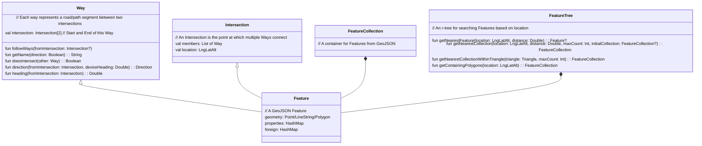

## GeoEngine introduction
The GeoEngine module takes care of parsing map tile data and making that data available to the rest of the app for generating audio callouts and some UI. The classes at the bottom levl are based around GeoJSON objects as per https://en.wikipedia.org/wiki/GeoJSON. Originally, the app was parsing GeoJSON from the soundscape-backend server and this was the natural result. However, now that we've switched to parsing Mapbox Vector Tiles the use of GeoJSON classes is somewhat legacy, though it does ease debugging as it's easy to output GeoJSON and render it on top of other maps e.g. using [geojson.io](https://geojson.io) . Here's a simplified view of the basic classes involved:



Features are points, lines or polygons along with some metadata describing what they are. We construct these based on the Mapbox Vector Tile contents and then divide them up into separate searchable FeatureTrees depending on the type of feature they are.

## Parsing the MVT (MapBox Vector Tiles)
Each MVT tile is processed layer by layer creating Features for all of the points that we are interested in. The main layers of interest are the POI which contains points and polygons for all of the various points of interest, and the transportation layers which contains roads and paths. We don't currently parse other layers (e.g. groundcover, water, housenumbers), though we may add some of those in future if we want to use that data e.g. rivers and streams.
After the initial parsing, some post-processing is done on the roads with the aim of:

* Finding Intersections so that we can call them out.
* Creating a Way for each segment of road/path between Intersections. Many of these will contain the same metadata because the original road/path in the tile stretched across multiple intersections.

## The TileGrid
At any time the app is working on a 2x2 grid of tiles. After parsing each tile independently, Ways which cross the tile boundaries need joining together, as do Polygons. The result is a set of FeatureCollections which cover the whole grid. The post processing on the grid is then:

* Categorising POIs into the same super categories as were present in iOS e.g. landmark, safety, mobility etc.
* The FeatureCollection for each category is then used to create a FeatureTree. That enables fast searching to find the nearest Feature, be that roads, intersections or POIs.
* Confect names for un-named ways (see below)

## Use the FeatureTrees
Searching the FeatureTrees is reasonably efficient, though multiple searches should be avoided due to CPU performance costs. They are very useful when generating the audio callouts. For nearby POI, `getNearestCollection` can be called to find POI within a certain distance from the user location. The alternative `getNearestCollectionWithinTriangle` can be used to search within a triangle rather than within a circle. If we do this with a `Triangle` created with one corner at the user location we can do a 'field-of-view' search. This also works for searching roads and paths.

## Traverse the Ways and Intersections
Once code has an Intersection or a Way it can follow Ways across the map tiles. Each Way has a reference to Intersections at either end and each Intersection contains a list of all of the Ways which comprise it. This traversal is very efficient and makes these features straightforward:

* Street Preview. It's possible to implement the Way traversal used by Street Preview using just FeatureTrees, but it's far more efficient to use Ways and Intersections.
* Name confection. This is how we add context to un-named paths and service roads. For each intersection that contains at least one named way (e.g. `"Roselea Drive"` rather than just `"path"`) we add a tag to each un-named way that joins that intersection. The tag will either be `"destination:forward"` or `"destination:backward"` depending on which way the Way runs (in to or out of the intersection). These can be used when describing paths later when approaching intersections e.g. `"Path to Roselea Drive"` when travelling one way, or `"Path to Mosswell Road"` when travelling in the opposite direction. We also add tags indicating dead-ends which is a useful way of filtering callouts e.g. don't call out un-named dead-ends - there are a lot of dead-end service roads in my local area, and calling them adds little context.
 
## Filters
Two filters in `geoengine/filters/` sit between raw sensor readings and the rest of the engine: a Kalman filter that smooths location and heading, and the map-matching filter that decides which road or path the user is actually walking on.

### KalmanFilter
`KalmanFilter` is a general N-dimensional Kalman filter parameterised by a single `filterSigma` that controls how quickly the filter's confidence in its previous estimate decays over time:

```kotlin
open class KalmanFilter(filterSigma : Double = 9.0, private val dimensions : Int = 2)
class KalmanLocationFilter(filterSigma : Double = 6.0) : KalmanFilter(filterSigma, 2)
class KalmanHeadingFilter (filterSigma : Double = 9.0) : KalmanFilter(filterSigma, 1)
```

Each `process()` call mixes a new measurement with the previous estimate. The mixing weight (the Kalman gain) is driven by two variances:

* The measurement variance, taken from the OS-reported accuracy (clamped to a small minimum to avoid divide-by-zero).
* The covariance of the current estimate, which grows linearly with elapsed time (`covariance += interval * sigma * sigma`) to represent the decay in confidence between updates.

The result is that high-accuracy fixes pull the estimate strongly toward the new measurement, while low-accuracy fixes barely move it. Two subclasses adapt the base filter to specific use cases:

* `KalmanLocationFilter` runs over `[longitude, latitude]` and is applied to every `FusedLocationProvider` update before it reaches the rest of the app. Its output is the location seen on `LocationProvider.filteredLocationFlow`, which is what the `GeoEngine`, `RoutePlayer` and audio callouts consume.
* `KalmanHeadingFilter` is a 1-D variant used for heading smoothing.

### MapMatchFilter
`MapMatchFilter` is what makes intersection callouts describe the correct approach road. Pedestrian map-matching is harder than car sat-nav map-matching because users can walk in any direction, cross open space, and switch between roads, pavements and paths at will. We are not trying to match a completed GPS trace; we have to decide road membership live, on every new filtered location.

The algorithm is based on the paper [*An Improved Map-Matching Technique Based on the Fréchet Distance Approach for Pedestrian Navigation Services* by Yoonsik Bang, Jiyoung Kim and Kiyun Yu](https://pmc.ncbi.nlm.nih.gov/articles/PMC5087552/), with our own approach for generating the candidate paths on which the algorithm runs. The paper doesn't cover candidate generation, so the bulk of our `MapMatchFilter` code is concerned with maintaining a live list of candidates.

Key types:

* **`RoadFollower`** — one candidate path. Holds an ordered list of `Way`s, an `IndexedLineString` view of them (so a point on the line can be mapped back to its source `Way` and original direction), a queue of recent Fréchet distances, and a state from `RoadFollowerState { LOCKED, UNLOCKED, ANGLED_AWAY, DIRECTION_CHANGED, DISTANT }`. `update()` returns a `RoadFollowerStatus(frechetAverage, state)` each tick.
* **`IndexedLineString`** — a `LineString` built by concatenating the geometries of a route of `Way`s. It tracks which segment belongs to which `Way` and whether the `Way` was reversed during concatenation, so that the per-point heading can be reported in the original `Way`'s direction. It also computes a hash code from its coordinates so identical followers can be de-duplicated.
* **`MapMatchFilter`** — the orchestrator. Holds the live `followerList`, the currently selected `matchedFollower`, and the last reported `matchedWay`/`matchedLocation`.

On every new filtered location:

1. `extendFollowerList` queries the `WAYS_SELECTION` `FeatureTree` for roads within 20 m. For each new road we either extend an existing follower into it (when it connects at an intersection of the route's start/end) or spawn a new follower. Dead-end ways shorter than 20 m are not pursued. The list is de-duplicated by `IndexedLineString` hash.
2. Each follower's `update()` computes the average Fréchet distance over a sliding window (`FRECHET_QUEUE_SIZE = 12`) between the user's recent track and the follower's line. Followers that are too far away, point the wrong way, or whose direction has just flipped are marked `DISTANT` / `ANGLED_AWAY` / `DIRECTION_CHANGED`. The remainder are candidates.
3. The follower with the lowest Fréchet average becomes the `matchedFollower` and the closest point on its line becomes `matchedLocation`. The corresponding `Way` is reported as `matchedWay` — that is the road that callouts will describe as the "current" road, and the basis on which intersection approach directions are computed.

The pre-filtered, map-matched location is what user-facing callouts use; the raw `FusedLocationProvider` location is still available on `LocationProvider.locationFlow` for callers (mainly the UI map) that prefer to render the unfiltered point.

## APIs
Most of the GeoEngine APIs use two pieces of data:

* `GridState` which contains all of the `FeatureTrees` for the current `TileGrid`
* `UserGeometry` which contains all of the information about the current user location, headings and map matched location. The heading calculations aim to match iOS which uses the phone heading, GPS travel heading as well as head tracking heading (not yet implemented on Android). It's possible to have no heading at all if the user isn't moving and the phone is locked and the phone is not held flat.

