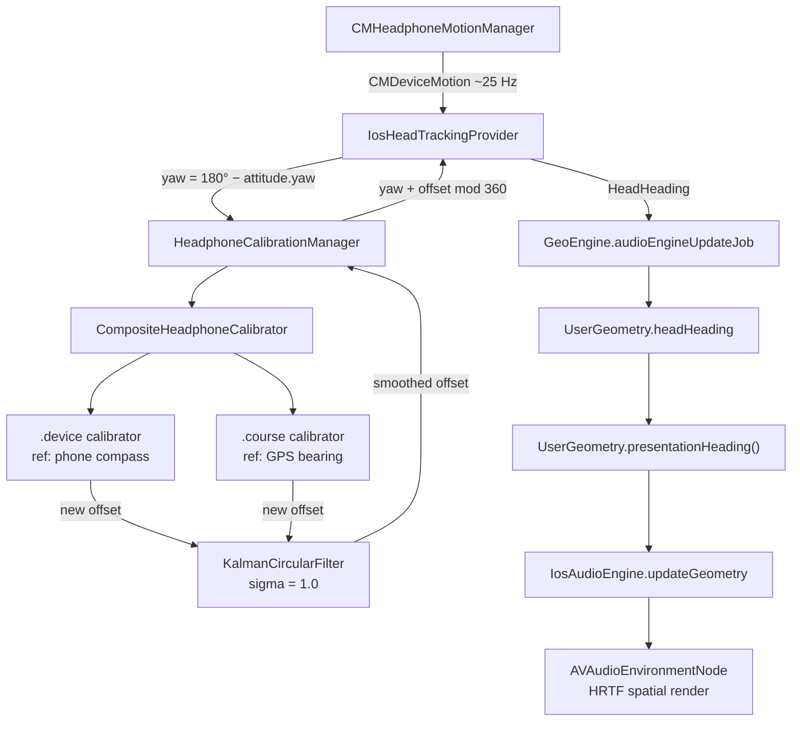

# AirPods head tracking on iOS

Soundscape's iOS build can derive the listener's head orientation from supported
AirPods (Pro, 3rd gen, Max) and use it to drive the spatial audio engine. When
the user looks at a beacon, the beacon sounds like it is in front of them —
regardless of which way the phone is pointing.

This document explains how the implementation is laid out, what each class does,
and the calibration algorithm that turns raw AirPods motion into a real-world
bearing. It is the developer's companion to the user-facing
**Settings → Audio → Use AirPods head tracking** toggle.

## What problem the code solves

`CMHeadphoneMotionManager` (Apple's API for AirPods motion) reports head
attitude relative to whichever direction the AirPods happened to be pointing
when motion updates started — not relative to true north. If we simply fed that
yaw into the audio engine, "north" would mean a different thing every time the
user puts the AirPods in.

Soundscape solves this **passively**, with no "face north and tap" UX. While
the user walks normally, the system correlates AirPods yaw with the phone's
compass and the GPS course over a 200-sample sliding window, learns the offset
between AirPods-frame and world-frame yaw, and adds that offset to every yaw
reading. The technique is ported from the original iOS Soundscape app — see
its `HeadphoneCalibrationManager` for the source-of-truth implementation.

## Where the code lives

The pure-Kotlin maths and orchestration live in the shared `commonMain` source
set so that a future Android implementation (e.g. using `Spatializer` head
tracking on Pixel Buds) can reuse them. Only the Apple-API binding is in
`iosMain`.

| File | Module | Role |
|------|--------|------|
| `geoengine/utils/CircularStatistics.kt` | commonMain | `normalizeDegrees`, `circularDifferenceDegrees`, circular mean & stddev. |
| `geoengine/filters/KalmanCircularFilter.kt` | commonMain | Wraps the existing 2-D `KalmanFilter` to filter angles via `[sin θ, cos θ]` so it handles wraparound at 0°/360°. |
| `geoengine/headtracking/HeadphoneCalibrator.kt` | commonMain | 200-sample sliding-window calibrator. Returns an offset estimate when the window's stddev drops below 10°. |
| `geoengine/headtracking/CompositeHeadphoneCalibrator.kt` | commonMain | Owns two `HeadphoneCalibrator` instances (one per reference source) and pushes new estimates through a single shared `KalmanCircularFilter`. |
| `geoengine/headtracking/HeadphoneCalibrationManager.kt` | commonMain | Per-frame entry point: takes raw yaw, returns `(yaw + offset) mod 360` as the world-frame heading, or `null` until calibration converges. |
| `locationprovider/HeadTrackingProvider.kt` | commonMain | Abstract base exposing a `headHeadingFlow: StateFlow<HeadHeading?>` and a 5-state `statusFlow`. |
| `locationprovider/IosHeadTrackingProvider.kt` | iosMain | Concrete provider. Owns `CMHeadphoneMotionManager`, runs the status state machine, drives the calibration manager. |

## End-to-end pipeline



## Why integration into the rest of the app is one line

`UserGeometry` already declares `headHeading` as a private constructor parameter
and `presentationHeading()` already prioritises it ahead of travel and phone
heading. `IosSoundscapeService.updateAudioEngineGeometry` already feeds
`presentationHeading()` to the audio engine. So once `headHeading` is non-null
in `UserGeometry`, AirPods orientation drives HRTF automatically — the audio
engine itself was not modified. The only wiring change in `GeoEngine` is to
add the head-heading flow to the `combine(...)` in `audioEngineUpdateJob` and
pass `headHeading = head?.degrees` into `createUserGeometry`.

## Calibration algorithm

### Per-frame yaw normalisation

`CMDeviceMotion.attitude.yaw` is in radians, in the AirPods' startup frame.
`IosHeadTrackingProvider` flips it so that yaw increases clockwise from the
AirPods origin:

```kotlin
val yawDegrees = 180.0 - attitude.yaw * RAD_TO_DEG
```

This 180° flip is **load-bearing** — the rest of the offset arithmetic assumes
this convention. If you change it, you must also flip the sign of the offset.

### Sample collection

For every motion frame, while a reference heading is available,
`HeadphoneCalibrator.process(yawDegrees, referenceDegrees, timestampMillis)`:

1. If `referenceDegrees == null`, clears the window and returns `null`.
2. Otherwise appends `Sample(referenceDegrees, yawDegrees)` to a deque.
3. Returns `null` until the deque has more than 200 entries.
4. Drops the oldest sample, then computes:
   - `differences = samples.map { circularDifferenceDegrees(it.referenceDegrees, it.yawDegrees) }`
   - `stdev = differences.circularStdDevDegrees()`
   - If `stdev >= 10°` returns `null` — the window failed the noise gate.
   - Otherwise returns `mean = differences.circularMeanDegrees()` as the
     calibration offset, and clears the window so the next 200 frames produce
     the next estimate.

All angle arithmetic uses `CircularStatistics`. Standard arithmetic mean of 359°
and 1° is 180°, but the circular mean is 0° — getting that wrong is the most
common porting mistake.

### The 10° stddev gate

Without the gate, the offset oscillates while the user looks around. The 10°
threshold rejects any window where the user's head rotation is decoupled from
their direction of motion. Walking straight ahead with the head roughly
forward passes easily; standing still and turning the head fails (which is
what we want — the algorithm skips that window and tries again).

### Two reference sources

`CompositeHeadphoneCalibrator` runs two calibrators in parallel:

- **`.device`** — phone compass via `IosDirectionProvider.orientationFlow`
  (`headingDegrees`, gated on `headingAccuracyDegrees >= 0`). Always available
  but unreliable indoors near steel/electronics.
- **`.course`** — GPS course via `IosLocationProvider.filteredLocationFlow`
  (`bearing`, gated on `hasBearing`). Only valid while moving but immune to
  magnetic interference.

When either calibrator emits an offset estimate, it goes through one shared
`KalmanCircularFilter` (sigma = 1.0). The filter's per-sample accuracy is the
stddev returned by the calibrator, so noisier estimates carry less weight.

### Circular Kalman trick

You cannot Kalman-filter angles directly without breaking at the 0/360
boundary. `KalmanCircularFilter` filters in 2-D instead, on
`[sin θ, cos θ]`, then converts back with `atan2(filtered[0], filtered[1])`.
The 2-D Kalman is the existing `KalmanFilter(dimensions = 2)` —
`KalmanCircularFilter` is a thin wrapper, not a reimplementation.

## Status state machine

`HeadTrackingStatus` is the contract between the provider and any UI. The
provider transitions through these states; nothing else writes to them.

| State | When |
|-------|------|
| `Unavailable` | iOS < 14.4, motion authorization denied/restricted, or `isDeviceMotionAvailable` is false. Terminal until app restart. |
| `Inactive` | Feature switched off in settings. Provider is constructed but motion updates are not running. |
| `Disconnected` | Feature on, motion updates active, but AirPods not in range. |
| `Connected` | AirPods present, motion frames arriving, calibration not yet converged. |
| `Calibrated` | Calibration converged at least once; `headHeadingFlow` is publishing real-world bearings. |

Transitions:

- `start()` → `Disconnected` (or `Unavailable` if a precondition fails).
- `headphoneMotionManagerDidConnect:` delegate → `Connected`. Calibration
  is reset so a fresh window starts from scratch.
- First time `calibrationManager.headingFor(yaw)` returns non-null →
  `Calibrated`.
- `headphoneMotionManagerDidDisconnect:` delegate → `Disconnected`,
  `headHeadingFlow.value = null`. Calibration is reset.
- `stop()` → `Inactive`, `headHeadingFlow.value = null`.

## Threading model

- `CMHeadphoneMotionManager` callbacks land on a dedicated
  `NSOperationQueue` named `HeadphoneMotionUpdatesQueue` with
  `maxConcurrentOperationCount = 1`. This keeps motion processing off the
  main queue, where AVAudio runs.
- Reference updates from `IosDirectionProvider.orientationFlow` and
  `IosLocationProvider.filteredLocationFlow` are collected on a private
  `CoroutineScope(Dispatchers.Default)`, so the producer threads are
  decoupled from the motion-callback queue.
- The two cached values (`lastDeviceHeadingDegrees`, `lastCourseDegrees`)
  are `@Volatile` so the motion-callback thread sees fresh data without a
  lock.
- `HeadphoneCalibrationManager` does ~µs of work per sample at 25 Hz, so
  the inner calibrators are not separately synchronised — the motion callback
  is single-threaded by virtue of the dedicated queue.

## Settings, permissions, and gating

- The user-facing toggle is `Settings → Audio → Use AirPods head tracking`,
  backed by `PreferenceKeys.HEAD_TRACKING_ENABLED` (default `false`).
- `IosSoundscapeService` reads the preference at startup and registers a
  `PreferencesListener` so toggling the switch immediately calls
  `headTrackingProvider.start()` or `stop()` without an app restart.
- iOS Motion & Fitness authorization is required —
  `iosApp/iosApp/Info.plist` declares `NSMotionUsageDescription`. The system
  prompt fires the first time the user enables the feature.
- iOS 14.4+ is required for `CMHeadphoneMotionManager` AirPods Max support.
  `IosHeadTrackingProvider.isHeadphoneMotionSupported()` checks
  `NSProcessInfo.processInfo.operatingSystemVersion` at runtime; on older
  OS versions the provider remains in `Unavailable` and never tries to
  instantiate the manager.

## Drift handling

There is no manual "recalibrate now" button. Drift is handled passively:

1. The 200-sample window keeps running forever — every successful window
   contributes a new estimate to the Kalman filter.
2. Both reference sources stay live. If the magnetometer drifts indoors, the
   `.course` calibrator can still update the offset once the user starts
   walking.
3. On disconnect, the calibration manager and Kalman filter are reset; on
   reconnect, a fresh ~200-frame calibration cycle begins.

If a "recalibrate" UI is ever needed, the cleanest hook is to call
`headTrackingProvider.stop()` followed by `headTrackingProvider.start()`.

## Tests

`shared/src/commonTest/kotlin/.../` covers:

- `CircularStatisticsTest` — wraparound, zero-boundary mean and stddev,
  constant-stream stddev, normalize, signed difference.
- `KalmanCircularFilterTest` — convergence on a constant input, behaviour
  across the 0/360° boundary.
- `HeadphoneCalibratorTest` — null before window fills, convergence on a
  synthetic `heading = yaw + 47°` stream, rejection of high-stddev windows,
  buffer reset on null reference.

The tests run as part of `:shared:testDebugUnitTest` (Android JVM) and
`:shared:iosSimulatorArm64Test` (Kotlin/Native simulator).

## Verification checklist for a real device

The unit tests prove the maths is correct; only a physical iPhone + AirPods
session can verify the end-to-end loop. Walk through these steps when you
change anything in the head-tracking pipeline:

1. Build and launch with head tracking **off** (default). Spatial audio must
   work exactly as before — `presentationHeading()` falls through to course
   then phone.
2. Toggle head tracking on. Approve the Motion & Fitness prompt. Connect
   AirPods. Status: `Inactive → Disconnected → Connected`.
3. Walk straight for ~10 s with the phone roughly forward. After ~200 frames
   (~8 s at 25 Hz), status flips to `Calibrated` and `headHeadingFlow` starts
   publishing.
4. Stand still and rotate the head 180°. The audio image should rotate ~180°.
   If it rotates ~0° or oscillates, the offset has the wrong sign — verify the
   `180.0 - attitude.yaw * RAD_TO_DEG` flip is intact.
5. Activate a beacon and turn until you face it directly. It should sound
   directly in front, regardless of phone orientation.
6. Pop AirPods out. Status returns to `Disconnected`, `headHeading` is `null`
   within a couple of frames, audio falls back to course/phone with no
   glitching.
7. Re-seat AirPods. Fresh calibration cycle, ~200 frames to `Calibrated` again.

## Out of scope (today)

- **Android.** The shared abstractions are in `commonMain`, but no Android
  `HeadTrackingProvider` implementation ships yet. Android 13+
  `Spatializer.OnHeadToSoundstagePoseUpdatedListener` would be the natural
  data source for compatible Pixel Buds.
- **Reachability probe.** The original iOS app has a separate
  `HeadphoneMotionManagerReachability` that briefly probes for AirPods before
  the user enables the feature; we rely on the toggle's connect/calibrate
  state instead.
- **Per-source debug toggles.** The original app exposes
  `*DeviceHeadingEnabled`, `*CourseEnabled`, `*VerboseLoggingEnabled`
  developer toggles. We have not ported these yet — add them to a Debug
  section of `SharedSettingsScreen` if you need to A/B the calibrator
  sources in the field.
- **Telemetry.** Connect/disconnect and calibration events are not yet
  wired into `Analytics` — wire them in when you need to measure head
  tracking adoption.
