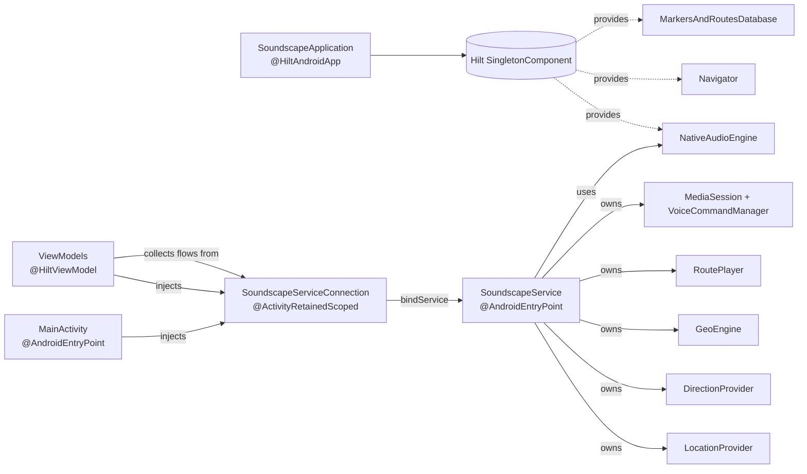

# Service and dependency-injection architecture

The app is organised around a single foreground service (`SoundscapeService`) that owns location, direction, audio and the geo-engine while it is running, and a Hilt-based dependency graph that wires the rest of the UI to it. This document describes how those pieces fit together and how data flows between them.

## Hilt setup

The application class is the Hilt entry point:

```kotlin
@HiltAndroidApp
class SoundscapeApplication : Application()
```

Hilt then injects into the two Android entry points (`MainActivity`, `SoundscapeService`) and every `@HiltViewModel` automatically. Provided singletons live in `app/src/main/java/.../di/HiltModule.kt`:

| Provider | Provides | Why singleton |
| --- | --- | --- |
| `AppNativeAudioEngine` | `NativeAudioEngine` (calls `initialize(context)` on creation) | The native audio engine owns a single Oboe output stream and Steam Audio context. |
| `AppSoundscapeNavigator` | `Navigator` | One nav controller, shared by all Compose screens via VM injection. |
| `DataStoreModule` | `MarkersAndRoutesDatabase`, `RouteDao` | Room database singleton, plus the DAO it exposes. |

`SoundscapeServiceConnection` is `@ActivityRetainedScoped` — one instance per activity lifecycle — because it holds the bound `SoundscapeService` reference and a `serviceBoundState` flow that activities and view-models observe.

`MainActivity` is `@AndroidEntryPoint` and field-injects the four objects it needs:

```kotlin
@AndroidEntryPoint
class MainActivity : AppCompatActivity() {
    @Inject lateinit var soundscapeServiceConnection : SoundscapeServiceConnection
    @Inject lateinit var navigator : Navigator
    @Inject lateinit var soundscapeIntents : SoundscapeIntents
    @Inject lateinit var audioTour : AudioTour
}
```

View-models are annotated `@HiltViewModel` and receive `SoundscapeServiceConnection`, the Room DAOs, and other singletons by constructor injection. There is no manual DI plumbing outside `HiltModule.kt`.

## The foreground service

`SoundscapeService` extends `MediaSessionService` (so the media-key controls and the audio menu can attach to it) and is annotated `@AndroidEntryPoint`. It is responsible for everything that has to keep running while the app is in the background:

* The `LocationProvider` (`AndroidLocationProvider`, `GooglePlayLocationProvider`, or `GpxDrivenProvider` for testing).
* The `DirectionProvider`.
* The `GeoEngine`, which owns the `TileGrid`, `FeatureTree`s, `MapMatchFilter` and callout generation.
* The `RoutePlayer`.
* The Hilt-injected `NativeAudioEngine` (effectively re-borrowed from the singleton — see [Audio engine]()).
* The `MediaSession` and the media-control / voice-command machinery in `services/mediacontrol/`.

Internally the service runs its work on a `CoroutineScope(Job())` and exposes state to the rest of the app as `StateFlow`s:

```kotlin
private val _beaconFlow         = MutableStateFlow(BeaconState())
private val _streetPreviewFlow  = MutableStateFlow(StreetPreviewState(StreetPreviewEnabled.OFF))
private val _gridStateFlow      = MutableStateFlow<GridState?>(null)
val voiceCommandStateFlow: StateFlow<VoiceCommandState>
    get() = voiceCommandManager?.state ?: MutableStateFlow(VoiceCommandState.Idle)
```

`onCreate`/`onDestroy` start and tear down all of the above; `onStartCommand` promotes the service to foreground (notification, location-foreground-service type) so Android will not kill it while the screen is off.

## Binding the UI to the service

The UI side does not call into the service directly. Instead `SoundscapeServiceConnection` mediates:

```kotlin
@ActivityRetainedScoped
class SoundscapeServiceConnection @Inject constructor() {
    var soundscapeService: SoundscapeService? = null
    private val _serviceBoundState = MutableStateFlow(false)
    val serviceBoundState = _serviceBoundState.asStateFlow()

    private val connection = object : ServiceConnection {
        override fun onServiceConnected(name: ComponentName, binder: IBinder) {
            soundscapeService = (binder as SoundscapeBinder).getSoundscapeService()
            _serviceBoundState.value = true
        }
        override fun onServiceDisconnected(name: ComponentName) {
            _serviceBoundState.value = false
            soundscapeService = null
        }
    }
    fun tryToBindToServiceIfRunning(context: Context) { /* bindService(...) */ }
    // ...one-shot pass-throughs: setStreetPreviewMode, startBeacon, routeSkipNext, ...
}
```

It also exposes the service's `StateFlow`s back out so view-models can `collect` them without ever touching `SoundscapeService` directly:

```kotlin
fun getLocationFlow()      : StateFlow<Location?>?            = soundscapeService?.locationProvider?.locationFlow
fun getOrientationFlow()   : StateFlow<DeviceDirection?>?     = soundscapeService?.directionProvider?.orientationFlow
fun getBeaconFlow()        : StateFlow<BeaconState>?          = soundscapeService?.beaconFlow
fun getCurrentRouteFlow()  : StateFlow<RoutePlayerState>?     = soundscapeService?.routePlayer?.currentRouteFlow
fun getGridStateFlow()     : StateFlow<GridState?>?           = soundscapeService?.gridStateFlow
fun getStreetPreviewModeFlow() : StateFlow<StreetPreviewState>? = soundscapeService?.streetPreviewFlow
fun getVoiceCommandStateFlow() : StateFlow<VoiceCommandState>? = soundscapeService?.voiceCommandStateFlow
```

The pattern is: view-models inject `SoundscapeServiceConnection`, gate their work on `serviceBoundState`, and read flows off the connection. Mutating actions go through one-shot methods on the connection (`startBeacon`, `routeStart`, `routeSkipNext`, `setStreetPreviewMode`, …) which forward to the live service if there is one.

## Lifecycle summary



Lifecycle in practice:

1. `SoundscapeApplication` is created. Hilt builds the singleton graph; `NativeAudioEngine.initialize` opens the Oboe stream eagerly.
2. `MainActivity` starts. Hilt injects `SoundscapeServiceConnection` (and friends).
3. Once permissions are granted, `MainActivity` requests `SoundscapeService` to start as a foreground service and `SoundscapeServiceConnection.tryToBindToServiceIfRunning` binds to it.
4. `serviceBoundState` flips to `true`. View-models that were waiting begin collecting the service's flows.
5. The user navigates between screens; view-models come and go but the service and the audio engine survive.
6. When the user stops the service from the UI, `SoundscapeService.stopForegroundService` is called; `onDestroy` cancels the coroutine scope and tears down providers. The `NativeAudioEngine` singleton stays alive because Hilt owns it.

## C++ → Kotlin callbacks reaching the service

The native audio engine notifies Kotlin when its beacon queue drains, via the JNI listener pattern documented in [Audio engine](). `NativeAudioEngine.onAllBeaconsCleared` forwards that to the bound `SoundscapeService.abandonAudioFocus()` so that the audio focus is given back when there is nothing left to play. This is the only path where C++ talks back into the service rather than the other way around.
